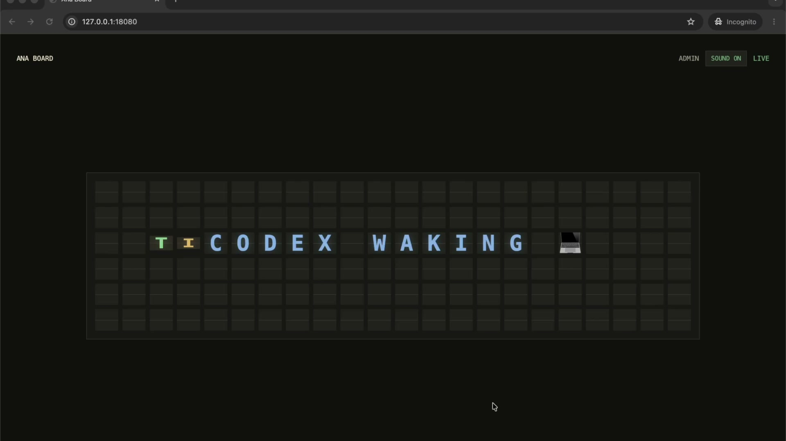

# Ana Board

Ana Board is a small Go-powered split-flap style status board for agents, automations, reminders, CI jobs, and local scripts.

It runs as one local Go server with a browser display, an admin panel, a command-line sender, and a stdio MCP server for tools like Codex, Claude Code, OpenCode, and remote agents such as Hermes.

[](https://www.youtube.com/watch?v=J5JMXApnEPc)

[Watch the demo video](https://www.youtube.com/watch?v=J5JMXApnEPc)

## About

Ana Board is a private status display for the small signals that should interrupt you gently:

- agent progress updates
- reminders
- email/task nudges
- CI/build/deploy status
- approval requests
- quick personal automations

The usual setup is:

```text
Agent or script
  -> ana-boardctl or ana-board-mcp
  -> private Ana Board HTTP API
  -> browser split-flap display
```

Ana Board is intentionally local-first. Run the display where you can see it, then let remote agents reach it over a private network. It is not ready to expose as a public unauthenticated web service.

Pieces:

- `ana-board`: local web server, display, admin panel, HTTP API, SSE stream
- `ana-boardctl`: CLI sender for scripts, cron, CI, and remote shells
- `ana-board-mcp`: stdio MCP server for Codex, Claude Code, OpenCode, Hermes-style agents

## Install

Install Go 1.22 or newer, then install the three binaries:

```sh
go install github.com/georgestander/ana-board/cmd/ana-board@latest
go install github.com/georgestander/ana-board/cmd/ana-boardctl@latest
go install github.com/georgestander/ana-board/cmd/ana-board-mcp@latest
```

Make sure Go's bin directory is on `PATH`:

```sh
export PATH="$PATH:$(go env GOPATH)/bin"
```

## Upgrade

Upgrade all three binaries together:

```sh
go install github.com/georgestander/ana-board/cmd/ana-board@latest
go install github.com/georgestander/ana-board/cmd/ana-boardctl@latest
go install github.com/georgestander/ana-board/cmd/ana-board-mcp@latest
```

Then restart the running `ana-board` server process. Updating `ana-boardctl` or `ana-board-mcp` does not update an already-running board server.

## Run

```sh
ana-board
```

Open:

```text
http://localhost:8080
http://localhost:8080/admin
```

The server binds to `127.0.0.1:8080` by default. Use another bind address or port explicitly:

```sh
ANA_BOARD_ADDR=127.0.0.1:18080 ana-board
```

Bind an additional local or private address when the same board should be reachable through more than one interface:

```sh
ANA_BOARD_ADDR=<board-private-ip>:18080 ANA_BOARD_EXTRA_ADDRS=127.0.0.1:18080 ana-board
```

Browser-based writes from the admin page are accepted only from trusted browser origins derived from `ANA_BOARD_ADDR` and `ANA_BOARD_EXTRA_ADDRS`. CLI, MCP, and script writes without a browser `Origin` header still work. If you open the board through a DNS name or reverse proxy, configure that exact origin:

```sh
ANA_BOARD_TRUSTED_ORIGINS=http://ana-board-host:18080 ana-board
```

From a local clone:

```sh
go run ./cmd/ana-board
```

## Private Network Access

Use this when the board is running on one machine and an agent, script, or server on another private machine needs to send updates to it. This can be a VPN, tailnet, VPC, WireGuard network, or any private network you control.

On the board machine, find the private IP address that the other machine can reach. Then bind Ana Board to that private address:

```sh
ANA_BOARD_ADDR=<board-private-ip>:18080 ana-board
```

Open the board from a browser that can reach that private network:

```text
http://<board-private-ip>:18080
http://<board-private-ip>:18080/admin
```

On the sender machine, point the CLI or MCP server at that board URL:

```sh
export ANA_BOARD_URL=http://<board-private-ip>:18080
ana-boardctl send --source agent --kind task "[green]AGENT CONNECTED ✅"
```

If browser admin writes use a private DNS name instead of the bind IP, add it to `ANA_BOARD_TRUSTED_ORIGINS` on the board machine.

If the sender can ping the board machine but cannot send messages, check that Ana Board is listening on the private IP rather than only `127.0.0.1`:

```sh
lsof -nP -iTCP:18080 -sTCP:LISTEN
curl http://<board-private-ip>:18080/healthz
```

Do not expose Ana Board's unauthenticated write API on the public internet. Keep it on localhost or a private network you control.

## Send A Message

From the browser, use:

```text
http://localhost:8080/admin
```

From HTTP:

```sh
curl -X POST http://localhost:8080/api/messages \
  -H "Content-Type: application/json" \
  -d '{"text":"[green]B[amber]U[blue]I[violet]L[green]D PASSED ✅","source":"ci","kind":"build"}'
```

From the CLI:

```sh
ana-boardctl capabilities --json
ana-boardctl preview "[blue]HELLO WORLD 🌍"
ana-boardctl send --source codex --kind success "[green]BUILD PASSED ✅"
ana-boardctl send --tiles-json '[{"symbol":"A","color":"green"},{"symbol":"N","color":"amber"},{"symbol":"A","color":"red"}]'
ana-boardctl send --segments-json '[{"text":"ANA ","color":"green"},{"text":"READY ✅","color":"blue"}]'
ana-boardctl art list
ana-boardctl send --sprite trophy --source codex --kind success
ana-boardctl frame --image ./tiny.png --source codex
ana-boardctl frame --placements-json '[{"row":0,"col":0,"symbol":"A","color":"green"},{"row":5,"col":21,"symbol":"✅","color":"blue"}]'
ana-boardctl send --at "2026-05-31T18:30:00+02:00" "[amber]REMINDER ⏰"
```

Use a remote/private board URL:

```sh
ANA_BOARD_URL=http://ana-board-host:18080 ana-boardctl send --source hermes "[amber]EMAIL NEEDS REPLY ✉️"
```

## MCP

`cmd/ana-board-mcp` exposes a fixed stdio MCP tool surface:

- `ana_board_capabilities`
- `ana_board_preview_message`
- `ana_board_send_message`
- `ana_board_list_sprites`
- `ana_board_preview_sprite`
- `ana_board_send_sprite`
- `ana_board_current`
- `ana_board_recent_messages`
- `ana_board_clear`, requiring `confirm=true`

Claude Code:

```sh
claude mcp add --transport stdio ana-board -- /absolute/path/to/ana-board-mcp
```

Claude Code JSON form:

```sh
claude mcp add-json ana-board '{"type":"stdio","command":"/absolute/path/to/ana-board-mcp","args":[],"env":{"ANA_BOARD_URL":"http://localhost:8080"}}'
```

OpenCode:

```jsonc
{
  "$schema": "https://opencode.ai/config.json",
  "mcp": {
    "ana-board": {
      "type": "local",
      "command": ["/absolute/path/to/ana-board-mcp"],
      "enabled": true,
      "environment": {
        "ANA_BOARD_URL": "http://localhost:8080"
      }
    }
  }
}
```

Remote agents can run the MCP process locally and point it at a private board URL:

```sh
ANA_BOARD_URL=http://ana-board-host:18080 ana-board-mcp
```

Do not expose this unauthenticated API on the public internet yet. Keep it private on localhost or a tightly scoped private network.

## Message Limits

- Board size: 10 rows x 22 columns.
- Text is normalized to uppercase.
- Spaces collapse.
- Allowed plain characters: `A-Z`, `0-9`, space, `.`, `,`, `!`, `?`, `:`, `-`, `/`, `'`, `"`, and `█`.
- Native emoji can be written directly. On Apple devices they render as native iOS/macOS emoji.
- Ana Board does not use an emoji whitelist. The alias list is only a shortcut list.
- Emoji grapheme clusters such as `✅`, `👍🏽`, `🇿🇦`, and `👨‍👩‍👧‍👦` count as one board tile.
- Common named aliases like `:rocket:`, `:check:`, `:warning:`, `:mail:`, `:calendar:`, and `:globe:` also work.
- Unknown named aliases are treated as plain text, so agents are safest when they send native emoji directly.
- Messages that need more than 10 rows fail.
- Words longer than 22 tiles fail.
- Exact per-tile color can be sent with JSON `tiles`: `[{"symbol":"A","color":"green"},{"symbol":"N","color":"amber"},{"symbol":"A","color":"red"}]`.
- Quick text can color individual letters with inline tokens: `[green]A[amber]N[red]A [blue]READY`.
- Agents can also send JSON `segments` when phrases share a color: `[{"text":"OK ","color":"green"},{"text":"FAIL","color":"red"}]`.
- Exact sparse placement can be sent with JSON `placements`: `[{"row":0,"col":0,"symbol":"A","color":"green"}]`.
- Full exact frames can be sent with JSON `frame`: `cells` must be 10 rows x 22 columns; `colors` is optional and must match the same shape.
- Block art uses the `█` symbol as a colored pixel. Named sprites are available through `ana-boardctl --sprite` and MCP sprite tools; local image conversion is available through `ana-boardctl --image`.
- The `color` metadata field is only the default for tiles without an inline token or segment color.
- Optional exact-time sending is client-side: `ana-boardctl send --at ...` waits until that time, then sends.

Metadata:

- `animation`: `row`
- `color`: default/fallback tile color, one of `white`, `green`, `amber`, `red`, `blue`, `violet`
- `kind`: `info`, `success`, `warning`, `error`, `reminder`, `email`, `task`, `deploy`, `build`
- `priority`: `low`, `normal`, `high`

## API

```text
GET  /healthz
GET  /
GET  /admin
POST /admin/messages
POST /admin/clear
GET  /api/current
GET  /api/messages
POST /api/messages
POST /api/clear
GET  /events
```

## Test

```sh
go test ./...
go vet ./...
node --check web/static/board.js
node --check web/static/admin.js
```

If Go tries to write its build cache outside the sandboxed workspace:

```sh
GOCACHE=$PWD/.gocache go test ./...
```
